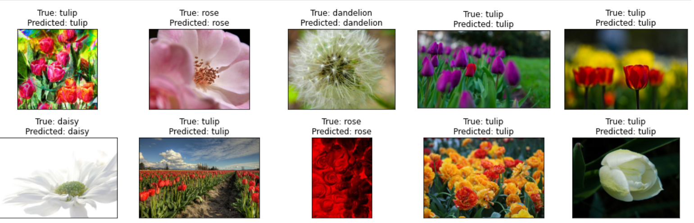

# Flower Identification Model

## Project Overview
This project focuses on developing a neural network model capable of identifying flower species from images. The model is designed to handle both clear and blurred images, applying image processing techniques to enhance image quality where necessary before making predictions.



## Features
- **Image Processing:** Incorporates techniques to detect and correct blurriness in flower images using Fast Fourier Transform (FFT) and other advanced methods.
- **Deep Learning Model:** Utilizes a convolutional neural network (CNN) architecture to classify flowers into various species.
- **Data Augmentation:** Employs real-time data augmentation to increase the diversity of the training dataset, improving the robustness of the model.

## Prerequisites
Before running this project, you need to install the following:
- Python 3.8 or newer
- TensorFlow 2.x
- Numpy, Pandas, Matplotlib, Scikit-Image, PyLops

You can install all required libraries with the following command:
```bash
pip install tensorflow numpy pandas matplotlib scikit-image pylops
```

## Installation
Clone the repository to your local machine:
```bash
git clone https://github.com/RohithRao0507/FlowerVision.git
cd FlowerVision
```

## Usage
To run the model, execute the Jupyter notebook `flower-recognizing-model-blurred-images.ipynb`:
```bash
jupyter notebook flower-recognizing-model-blurred-images.ipynb
```
Follow the instructions in the notebook to train and test the flower identification model.

## Dataset
The dataset consists of flower images categorized by species, stored under the `flowers` directory. Each subdirectory within `flowers` represents a species and contains images corresponding to that flower type.

## Model Architecture
The model uses a series of convolutional, max pooling, and dense layers to process and classify images. Data augmentation techniques such as rotation and zoom are applied to train the model effectively.


## Flower Vision Model Highlights and Actionable Improvement Areas

**Flower Vision** achieves high classification accuracy and robustness in recognizing a wide range of flower species, even from blurred images, using advanced image processing and convolutional neural networks.

#### Key Achievements:
- **High Accuracy & Specificity:** Ensures precise identification critical for educational and research applications.
- **Advanced Image Processing:** Corrects image blurriness, maintaining performance across various image qualities.

#### Improvement Plans:
- **Expand and Diversify Data:** Future updates will include a broader dataset to reduce misclassifications and enhance model generalization, with a focus on underrepresented species.
- **Refine Model Design:** We will refine network complexity and employ advanced cross-validation techniques to mitigate overfitting.

#### How to Contribute:
- **Data Contributions:** Share images of diverse flower species to help improve our dataset.
- **Feedback & Feature Suggestions:** Test the model, provide feedback, and suggest features to enhance its capabilities.
